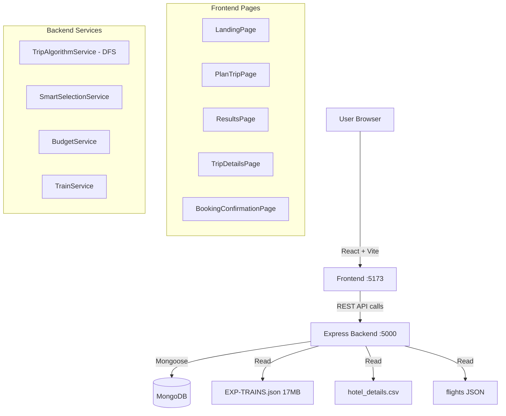
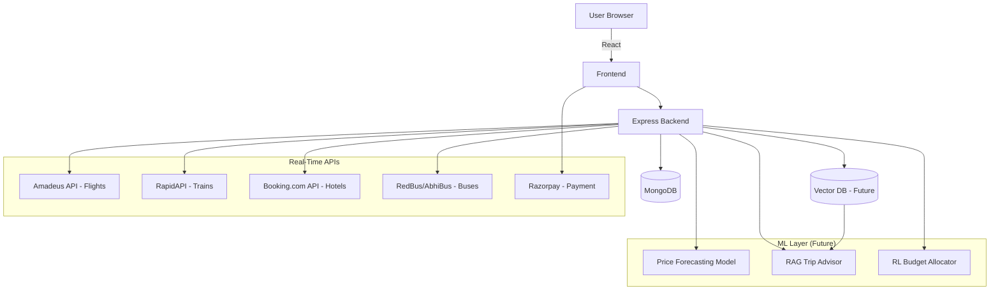

# TripSmart — Comprehensive System Design

> **Reference:** Inspired by open-source projects like [open-trip-planner](https://github.com/opentripplanner/OpenTripPlanner) and trip planning apps like Wanderlog and Tripit.

---

## 1. What We're Building

TripSmart is a **budget-aware, constraint-solving trip planning engine** for Indian travelers. Given a budget, dates, and preferences, it generates multiple trip plans using a DFS backtracking algorithm — then lets users view, compare, and book them.

---

## 2. Current Architecture (AS-IS)



---

## 3. Data Sources & APIs

### 3.1 Transport

| Mode | Current | Recommended API | Cost |
|---|---|---|---|
| **Trains** | EXP-TRAINS.json + MongoDB | [RapidAPI Indian Railways](https://rapidapi.com/search/indian+railway) | Free tier |
| **Flights** | Local JSON | [Amadeus Flight Offers Search](https://developers.amadeus.com/) | Free (2000 calls/month) |
| **Buses** | ❌ Not implemented | [redBus API](https://www.redbus.in/info/apidevelopers) or RapidAPI wrappers | Paid |

> **For train fare lookup** (what you asked about): The current system reads fares from `EXP-TRAINS.json`. When we move to real APIs, the **Indian Railways fare API** exists via:
> - [RailYatri API](https://www.railyatri.in/api) (partner access)
> - [Confirmtkt](https://www.confirmtkt.com/) — has a public fare endpoint
> - **Best practical choice:** Parse ixigo or IRCTC's mobile API (reverse-engineered — grey area) OR use the official [CRIS API](https://enquiry.indianrail.gov.in/mntes/) for inquiry endpoints

> **For flights**: You already have `AMADEUS_API_KEY` and `AMADEUS_API_SECRET` in `.env.example`. Use [Amadeus Self-Service](https://developers.amadeus.com/self-service/category/flights/api-doc/flight-offers-search) — it returns real prices.

> **For buses**: RedBus doesn't have a public API. Best option is the [AbhiBus API](https://www.abhibus.com/bus-operator-software) (limited, partner access) or scraping via [Paytm Bus RapidAPI](https://rapidapi.com/category/Travel).

### 3.2 Accommodation

| Type | Current | Notes |
|---|---|---|
| **Hotels** | hotel_details.csv | Sufficient for MVP |
| **Future API** | [Booking.com via RapidAPI](https://rapidapi.com/tipsters/api/booking-com) | Real-time prices |

**Design decision: Hotels only (binary Yes/No)**
- User selects a hotel from results
- Clicks "Book Hotel" → BookingConfirmationPage with hotel details pre-filled
- API call to hotel booking API (Booking.com / MakeMyTrip)

### 3.3 Meals

- Currently: Estimated as cost tier × meals/day × travelers
- **Schema gap:** Meals are `foodTotal` number, not day-by-day itemized
- **Future:** Add restaurant name, cuisine type, rating (from Zomato API or similar)
- **For now:** Keep as budget tier (BUDGET/MEDIUM/EXPENSIVE) in schema — no API needed yet

### 3.4 Activities

- Currently: Pulled from `destCity.attractions[]` in cities data
- **Future:** [Viator API](https://docs.viator.com/) or [GetYourGuide API](https://partner.getyourguide.com/) for bookable tours
- **For now:** Keep as static destination data

---

## 4. Trip Object Schema (Target)

```javascript
// MongoDB Trip Schema — Target state
{
  userId: ObjectId,
  source: { code, name, state },
  destination: { code, name, state },
  startDate: Date,
  endDate: Date,
  
  // 📅 Duration (transport-aware)
  requestedNights: Number,       // what user asked for
  nights: Number,                // actual hotel nights (after overnight deduction)
  durationDays: Number,          // total calendar days
  overnightCount: Number,        // nights spent in transit
  usableDays: Number,            // durationDays - overnightCount (for food/activity calc)
  
  travelers: Number,
  budget: { amount, currency, flexibility },
  
  plans: [{
    tier: String,                // 'Budget' | 'BestValue' | 'Premium'
    category: String,            // 'Budget Train' | 'Premium Flight' etc.
    isOverBudget: Boolean,
    
    // 🚂 Transport (structured, not Mixed)
    transport: {
      mode: String,              // 'train' | 'flight' | 'bus'
      operator: String,          // 'Rajdhani Express' / 'IndiGo'
      number: String,            // '12301' / '6E-215'
      class: String,             // '1A'/'2A'/'3A'/'SL' / 'Economy'/'Business'
      overnightCount: Number,    // KEY FIX: how many nights in transit
      departure: { station, time, date },
      arrival: { station, time, date },
      duration: { hours, minutes },
      cost: { perPerson, total },
      bookingUrl: String         // IRCTC deeplink / airline booking URL
    },
    
    // 🏨 Accommodation (structured)
    accommodation: {
      name: String,
      stars: Number,
      location: String,
      pricePerNight: Number,
      nights: Number,            // = parent nights (after overnight deduction)
      totalCost: Number,
      rating: Number,
      reviews: Number,
      amenities: [String],
      bookingUrl: String
    },
    
    // 🍽️ Meals (new structured schema)
    meals: {
      tier: String,              // 'BUDGET' | 'MEDIUM' | 'EXPENSIVE'
      dailyCostPerPerson: Number,
      totalCost: Number,
      // future: day-by-day breakdown
    },
    
    // 🎯 Activities
    activities: {
      tier: String,
      dailyCostPerPerson: Number,
      totalCost: Number,
      list: [{ name, price, duration, rating, type }]
    },
    
    // 📊 Breakdown (all costs)
    breakdown: {
      transportTotal: Number,
      accommodationTotal: Number,
      foodTotal: Number,
      activityTotal: Number,
      nightsUsed: Number,        // already exists ✅
      usableDays: Number,        // NEW: for food/activity calculation
      overnightCount: Number     // NEW: mirrors transport.overnightCount
    },
    
    totalCost: Number,
    score: Number,
    highlights: [String],
    itinerary: [{ day, title, date, activities: [...] }]
  }],
  
  booking: {
    status: String,              // 'draft'|'saved'|'pending'|'confirmed'|'cancelled'
    selectedPlanTier: String,
    bookingId: String,
    paymentMethod: String,       // 'card'|'upi'|'netbanking'
    razorpayOrderId: String,     // for Razorpay integration
    razorpayPaymentId: String,
    contactInfo: { firstName, lastName, email, phone, address, city, state, pincode },
    totalAmount: Number,
    bookedAt: Date,
    
    // Booking status per component
    transportBooked: Boolean,
    hotelBooked: Boolean,
    transportBookingRef: String,  // IRCTC PNR / airline booking ref
    hotelBookingRef: String       // hotel confirmation number
  }
}
```

---

## 5. Bug Fix: Overnight Travel Day Count

### Root Cause

```
generateItinerary(destCity, actualNightsUsed, ...) in trips.js:1154
  → totalDays = nights + 1  ← Uses actualNightsUsed (already correct!)

BUT: TripDetailsPage.tsx:164
  const nights = parseInt(plan.duration?.match(/\d+/)?.[0] || '1');
  ← Parses "3 Nights" string, ignores plan.breakdown.nightsUsed
  ← WRONG for overnight trains — falls through to fallback generator
  ← Fallback generates wrong number of days
```

Also: Frontend at line 107 trusts `plan.itinerary` blindly, even if it was built for a different transport's night count.

### Fix Strategy

**Step 1: Backend — store `overnightCount` on transport option**
```javascript
// In _calculateCosts() and in convertAlgorithmPlan():
breakdown.overnightCount = nightsInTransit;
breakdown.usableDays = durationDays - nightsInTransit;
```

**Step 2: Backend — `generateItinerary()` passes usableDays**
```javascript
// trips.js line 468:
const planItinerary = generateItinerary(
  destCity, actualNightsUsed, tripType,
  { ...planTransportDetails, overnightCount: nightsInTransit }, 
  planHotelDetails, isReturnTrip
);
```

**Step 3: Frontend — `buildItineraryDays()` validates before trusting backend itinerary**
```typescript
// TripDetailsPage.tsx:107
if (plan.itinerary && plan.itinerary.length > 0) {
  const expectedDays = (plan.breakdown?.usableDays ?? plan.breakdown?.nightsUsed ?? 0) + 1;
  if (plan.itinerary.length !== expectedDays) {
    // mismatch — fall through to fallback generator
  } else {
    return normalizedDays; // trust backend itinerary
  }
}
// Fallback: use plan.breakdown.nightsUsed, NOT plan.duration string
const nights = plan.breakdown?.nightsUsed ?? parseInt(plan.duration?.match(/\d+/)?.[0] || '1');
```

**Step 4: API shape — pass `breakdown.usableDays` to frontend**
Already exists as `plan.breakdown.nightsUsed` — just need to also expose `overnightCount`.

---

## 6. Payment Flow (Target)

```
TripDetailsPage
  → "Book This Trip" button
  → POST /api/trips/create-order   (backend creates Razorpay order)
  ↓
BookingConfirmationPage
  → Traveler info form
  → Payment method selection
  → Razorpay Checkout SDK opens (real payment page)
  → On success: POST /api/trips/confirm-booking
    - Updates Trip.booking.status = 'confirmed'
    - Stores razorpayPaymentId, razorpayOrderId
    - Returns bookingId (TS-XXXX-XXXXXX format)
  → Success screen with:
    - Booking confirmation number
    - Transport: "Book on IRCTC" deeplink button
    - Hotel: "View hotel confirmation" details
    - Download itinerary PDF
```

**Current state:** BookingConfirmationPage exists and looks real, but uses fake 2s delay. Razorpay integration is next step.

---

## 7. White Text Bug in Light Mode

**Location:** [`theme.css`](file:///d:/TripSmart/src/styles/theme.css) line 198-199
```css
.glass-input {
  color: #e2e8f0 !important;  /* ← This is a light/off-white color */
}
```
The light mode override at line 209-213:
```css
:root:not(.dark) .glass-input {
  color: #1A1814 !important;  /* ← Should override */
}
```
**The issue:** The `:root:not(.dark)` selector should work, but if `PlanTripPage.tsx` applies `glass-input` to elements that aren't inside `:root:not(.dark)` context — or if Tailwind's purge removes the light mode override — the dark color won't apply.

**To investigate:** Which specific elements appear white in light mode? This determines if it's the `glass-input` CSS class, or `text-white` utility classes used in pages.

---

## 8. Future Architecture (TO-BE with APIs)



---

## 9. ML & AI Roadmap (Discussion Only — Not Executing Yet)

### 9.1 Price Forecasting (How it helps)

**Use case:** "Is now a good time to book?" badge on each trip plan card.

```
Historical fare data → LSTM or XGBoost model
  Features: route, season, days-before-departure, day-of-week, demand index
  Output: predicted fare in 3/7/14 days + trend direction (↑↓→)

User sees: "🔴 Rising prices — book today" or "🟢 10% below average — good time to book"
```

**Data:** Amadeus Historical Flight Price API (available in paid tier), IRCTC historical fares (no official API, need to scrape or use crowd data).

### 9.2 RAG Trip Advisor (How it integrates with our DFS)

Our DFS is a **constraint satisfaction problem (CSP)** — it finds feasible plans within budget. RAG is **semantic retrieval** — it finds contextually similar trips.

**They are complementary, not competing:**
1. DFS → finds 3-9 structurally feasible plans
2. RAG → re-ranks them based on semantic match to user's natural language preferences
3. User gets plans that are both budget-feasible AND contextually relevant

**Implementation idea:**
```
User says: "Beach trip, nightlife, budget under ₹20k for 3 days"
→ Embed query → find similar past trips in vector DB
→ Extract: "Goa is best match, COX's Bazar is second"
→ Pass destination hint to DFS → DFS finds feasible plans for Goa
→ RAG reranks activities/hotels based on semantic similarity to "beach + nightlife"
```

### 9.3 RL Budget Allocation (Post-payment "spend smarter" feature)

**After booking confirmation:**
```
User has ₹2,340 remaining budget
RL agent recommends:
  - "Upgrade to river-facing hotel room" (+₹800)
  - "Try sunset dinner cruise" (₹650, 4.8★ rating)  
  - "Rent a scooter for day 2" (₹400)
  - "Reserve ₹490 for emergencies"
```

**Model:** Multi-armed bandit (simpler) or Q-learning on user satisfaction signals (trip ratings, rebooking behavior).

---

## 10. Open Questions for Discussion

1. **Bus booking**: RedBus partner API requires applying. Do we build a bus form UI first with static fares, or skip?
2. **Razorpay**: Do we do a real Razorpay integration now (test mode), or keep the mock page?  
3. **Flight data**: Should we switch to Amadeus API now (free tier), or keep the local JSON?  
4. **Meals in itinerary**: Day-by-day with restaurant recommendations, or keep as cost estimate only?
5. **Hotel booking flow**: Should clicking "Book Hotel" open a modal/form, or go to hotel's own website?
